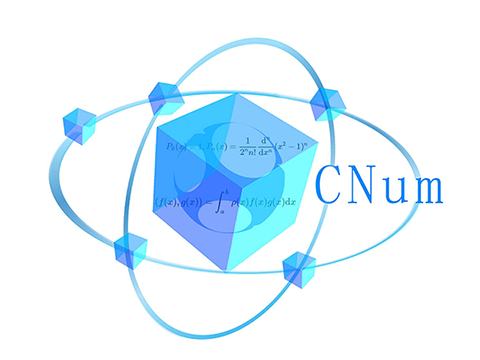

<a href="https://github.com/Wang-sx0103/NumericalCalculation/"></a>

# **NumericalCalculation**

A library on **numerical analysis** and **numerical calculation**.

[](https://github.com/Wang-sx0103/NumericalCalculation/releases)
[](LICENSE)

[](https://github.com/Wang-sx0103/NumericalCalculation/search?l=python)


## Prerequisites

- You must have a python v3.x interpreter

- Install with pip
  - Copy the [url](https://github.com/Wang-sx0103/NumericalCalculation/releases) of the latest installation package 
    ```shell
    https://github.com/Wang-sx0103/NumericalCalculation/releases/download/1.0.1/CNum-1.0.1-py3-none-any.whl
    ```
  - pip install
    ```shell
    pip install url
    ```

- Install with setup scripts

  - Clone or download this repository.

  - Install the package using `python setup.py install`.

## Doc

Please refer to the instruction [document](https://wang-sx0103.github.io/NumericalCalculation/) for detailed usage.  

---------

## Call

If you have questions or comments, please contact:

- AnonymityA@qq.com
- AlexWang0103@outlook.com
