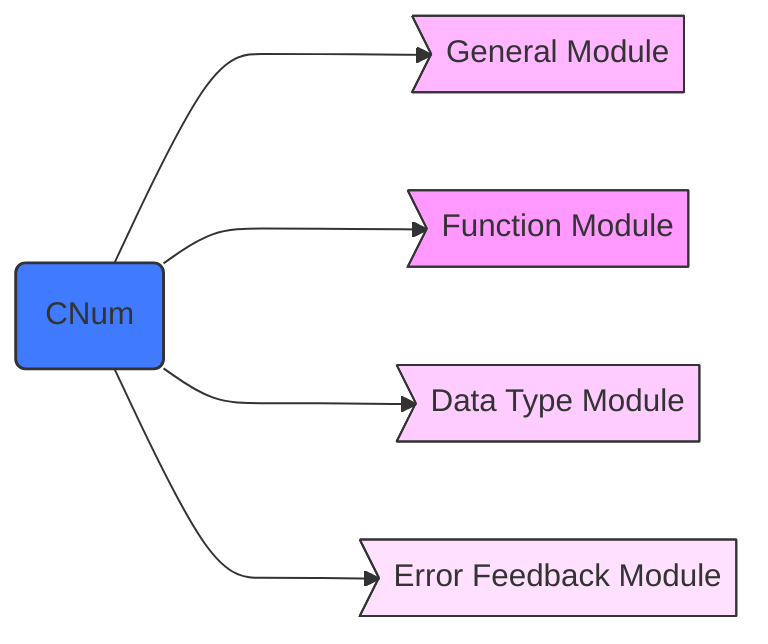

# **CNum**

## structure

This package includes four sub modules: `function module`, `data type module`, `error feedback module` and `general module`.  



## summary

  Next, we will briefly introduce the functions of each module

### function module

- [Elimination](https://github.com/Wang-sx0103/NumericalCalculation/blob/main/CNum/Elimination.py)
- [FuncAppro](https://github.com/Wang-sx0103/NumericalCalculation/blob/main/CNum/FuncAppro.py)
- [Integral](https://github.com/Wang-sx0103/NumericalCalculation/blob/main/CNum/Integral.py)
- [Interpolation](https://github.com/Wang-sx0103/NumericalCalculation/blob/main/CNum/Interpolation.py)
- [Iteration](https://github.com/Wang-sx0103/NumericalCalculation/blob/main/CNum/Iteration.py)
- [Power](https://github.com/Wang-sx0103/NumericalCalculation/blob/main/CNum/Power.py)
- [Root](https://github.com/Wang-sx0103/NumericalCalculation/blob/main/CNum/Root.py)
- [SquareRoot](https://github.com/Wang-sx0103/NumericalCalculation/blob/main/CNum/SquareRoot.py)
- [TriDecomposition](https://github.com/Wang-sx0103/NumericalCalculation/blob/main/CNum/TriDecomposition.py)

 These classes implement the main functions of this package. In the next chapter, we will describe the usage and functions of each class in detail.

### data type module

  This module contains only one class called `Matrix`. In a future release, it will implement data transfer between each module. However, we do not currently apply this data type.

### error feedback module

  The error feedback mechanism is implemented through this module

### general module

## Usage and function

### Elimination

**This class contains several elimination methods for solving linear equations.**  

- Calling Class

```python
import CNum.Elimination as et
```

- Constructor function
  - augMat: You need to provide an augmented matrix in the constructor.
    If you do not provide the augmented matrix here, you must provide it at the function called `setAugMat()`.

- Member function
  - `gauss`:
    Gauss elimination method.  
    - return(`list`): We will return the solution of the equations as a list.
  - `columnEliminate`:
    Elimination with Maximal Column Pivoting.  
    - return(`list`): We will return the solution of the equations as a list.
  - `completeEliminate`:
    complete pivoting.  
    - return(`list`): We will return the solution of the equations as a list.
  - others:
    There are other member functions in this class, but we **don't recommend** users to use them  

- demo

```python
import CNum


augMatrix = \
    [[2, 1, 0, 0, -0.5],
     [0.5, 2, 0.5, 0, 0],
     [0, 0.5, 2, 0.5, 0],
     [0, 0, 1, 2, 0]]
et = CNum.Elimination(augMatrix)
print(et.gauss())
print(et.columnEliminate())
print(et.completeEliminate())

```

### FuncAppro

**This class contains a methods in order to construct an n-order polynomial.**

- Calling Class

```python
import CNum.FuncAppro as fa
```

- Constructor function
  - xList(`list`): You need to provide a set of x-points.
    If you do not provide the vector here, you must provide it at the function called `setListX()`.  
  - yList(`list`): You need to provide a set of y-points.
    If you do not provide the vector here, you must provide it at the function called`setListY()`.  
  - **The length of `xList` must be equal to `yList`.**

- Member function
  - `PolyFitting`:
    Fitting an n-order polynomial.  
    - order(`int`): It represents the order of the fitting polynomial, you must provide an integer less than the number of coordinates.
    - return(`list`): We will return a list with a length of **order**+1. It represents the coefficients of the fitting polynomial from low to high.
  - others:
    There are other member functions in this class, but we **don't recommend** users to use them  

- demo

```python
import CNum


xList = [-1, -0.75, -0.5, -0.25, 0, 0.25, 0.5, 0.75, 1]
yList = [-0.2209, 0.3295, 0.8826, 1.4392, 2.0003, 2.5645,
         3.1334, 3.7601, 4.2836]
pf = CNum.FuncAppro(xList, yList)
print(pf.PolyFitting(2))

```

### Integral

**This class contains several quadrature methods in order to calculate the approximation of the integrand.  
But The integrand function needs to be provided by yourself.**  

- Calling Class

```python
import CNum.Integral as ig
```

- Constructor function
  - endPoint(`list`): You need to provide the value of the endpoint of the integral interval.
    If you do not provide the vector here, you must provide it at the function called `setEndPoint()`.

- Member function
  - `Trapezoid`:
    Composite Trapezoidal rule.  
    - callback(`function`): This is a callback function.
    The integrand function needs to be provided by yourself.  
    - num(`int`): Number of interval bisections.
    If you don't provide, we will default to 1.  
    - return(`float`): We will return an approximation of the integrand.
  - `Simpson`:
    Composite Simpson rule.  
    - callback(`function`): This is a callback function.
    The integrand function needs to be provided by yourself.  
    - half(`int`): Half of number of interval bisections.
    So the actual number of intervals is twice that of "half".  
    If you don't provide, we will default to 1.  
    - return(`float`): We will return an approximation of the integrand.
  - `TrapezoidHalf`:
    Successive half division algorithm of Trapezoidal function.  
    - callback(`function`): This is a callback function.
    The integrand function needs to be provided by yourself.  
    - threshold(`float`): You must provide an error in ending iteration.
    If you don't provide, we will default to 1/1000000.  
    - iteraNum(`int`): You need to provide a number of iterations.
    If you don't provide, we will default to 1000.  
    - return(`float`): We will return an approximation of the integrand.
  - `SimpsonHalf`:
    Successive half division algorithm of Simpson function.
    - callback(`function`): This is a callback function.
    The integrand function needs to be provided by yourself.
    - threshold(`float`): You must provide an error in ending iteration.
    If you don't provide, we will default to 1/1000000.  
    - iteraNum(`int`): You need to provide a number of iterations.
    If you don't provide, we will default to 1000.  
    - return(`float`): We will return an approximation of the integrand.
  - `Romberg`:
    Romberg quadrature formula, also called Successive half acceleration method.  
    - callback(`function`): This is a callback function.
    The integrand function needs to be provided by yourself.  
    - threshold(`float`): You must provide an error in ending iteration.
    If you don't provide, we will default to 1/1000000.  
    iteraNum(`int`): You need to provide a number of iterations.
    If you don't provide, we will default to 1000.  
    - return(`float`): We will return an approximation of the integrand.

- demo

```python
import CNum
import math


def f(x):
    return (math.log(1+x))/(1+x)**2


def f1(x):
    return math.exp(-x**2)


itg = CNum.Integral([0, 1])
print(itg.Trapezoid(f, 4))
print(itg.TrapezoidHalf(f, 0.000001, 100))
print(itg.Simpson(f, 2))
print(itg.SimpsonHalf(f, 0.000001, 100))
print(itg.Romberg(f1, 0.0001, 100))

```

### Interpolation

**This class contains several interpolation methods in order to construct the interpolation polynomial function and calculate the value at X-point.**  

- Calling Class

```python
import CNum.Interpolation as ip
```

- Constructor function
  - xList(`list`): You need to provide a set of x-points.
    If you do not provide the vector here, you must provide it at the function called "setListX" or "setKPoints".  
  - yList(`list`): You need to provide a set of y-points.
    If you do not provide the vector here, you must provide it at the function called `setListY` or `setKPoints`.
  - The length of `xList` must be **equal** to `yList`.  

- Member function
  - `Lagrange`:
    Lagrangian Interpolation Method.  
    - x(`float`): You must provide a real number.
    - return(`float`): We will return the value at x-point calculated by this interpolation method.
  - `Newton`:
    Newtow Interpolation Method.
    - x(`float`): You must provide a real number
    - return(`float`): We will return the value at x-point calculated by this interpolation method.
  - `Hermite`:
    Hermite Interpolation Method.  
    - x(`float`): You must provide a real number.\n
    - yDer1th(`list`): You need to provide a set of first derivative values at both ends of the XList in a list.
    return(`float`): We will return the value at x-point calculated by this interpolation method.
  - `CubicSpline`:
    Spline Interpolation Method.  
    This method constructs the interpolation function through the three-rotations equation.  
    - flag(`int`): First derivative value at given two end points.
      - 0: First derivative value at given two end points.
      - 1: Periodic function.
      - 2: Second derivative value at given two end points.\n
    - endPointDer(`list`):  You need to provide a set of derivative values at both ends of the XList in a list.
    - return(`float`): We will return the value at x point calculated by this interpolation method.
  - others:
    There are other member functions in this class, but we don't recommend users to use them  

- demo

```python
import CNum


xList = [0, 1, 2, 3]
yList = [0, 2, 3, 16]
itp = CNum.Interpolation(xList, yList)
print(itp.Lagrange(2.5))
print(itp.Newton(1.5))
xList = [0, 1]
yList = [0, 1]
yD = [3, 9]
print(itp.Hermite(0.5, yD))
print(itp.CubicSpline(2, 0, [1, 0]))

```

### Iteration

**This class contains several iterative methods in order to solve linear equations.**  

- Calling Class

```python
import CNum.Iteration as it
```

- Constructor function
  - augMat(`list`): You need to provide an augmented matrix,
    If you do not provide the augmented matrix here, you must provide it at the function called `setAugMat()`.  
  - xList(`list`): You need to provide an iterative initial value of XList,
    If you do not provide the list here, you must provide it at the function called `setIteraValue()`.  
  - iteraNum(`int`): You need to provide a number of iterations.
    If you don't provide, we will default to 100.
  - threshold(`float`): You need to provide an error in ending iteration.
    If you don't provide, we will default to 1/1000000.

- Member function
  - `Jacobi`:
    Jacob Iterative method.  
    - return(`list`): We will return the solution of the equations as a list.
  - `GaussSeidel`:
    Gauss-Seidel Iteration.  
    - return(`list`): We will return the solution of the equations as a list.
  - `SOR`:
    Successive Over - Relaxation Iteration.  
    - omega(float): you need to provide a Relaxation factor.
    If you don't provide, we will default to 100.  
    - return(list): We will return the solution of the equations as a list.

- demo

```python
import CNum


augMat = \
    [[2, 1, 0, 0, -0.5],
     [0.5, 2, 0.5, 0, 0],
     [0, 0.5, 2, 0.5, 0],
     [0, 0, 1, 2, 0]]
xList = [1, 1, 1, 1]
it = CNum.Iteration(augMat, xList, 100, 0.000001)
print(it.Jacobi())
print(it.GaussSeidel())
print(it.SOR(1.2))

```

### Power

**This class contains several power methods in order to solve the maximum or minimum eigenvalue according to the mold and the corresponding eigenvector.**

- Calling Class

```python
import CNum.Power as pr
```

- Constructor function
  - Matrix(`list`): You need to provide an matrix.
    If you do not provide the Matrix here, you must provide it at the function called `setMatrix()`.
  - XList(`list`): You need to provide an initialization eigenvector.
    If you do not provide the vector here, you must provide it at the function called `setInitEigenvectors()`.
  - iteraNum(`int`): You need to provide a number of iterations.
    If you don't provide, we will default to 100.
  - threshold(`float`): You need to provide an error in ending iteration.
    If you don't provide, we will default to 1/1000000.

- Member function
  - `NorPower`:
    Normalized power method.  
    - return(`float`): We will return the maximum eigenvalue according to the mold.
  - `OriginShift`:
    Origin shift method.  
    - return(`float`): We will return the maximum eigenvalue according to the mold.
  - `Aitken`:
    Aitken acceleration.  
    - return(`float`): We will return the maximum eigenvalue according to the mold.
  - `InversePower`:
    Inverse power methond.  
    - return(`float`): We will return the minimum eigenvalue according to the mold.

- demo

```python
import CNum


Matrix = \
    [[2, -1, 0],
    [0, 2, -1],
    [0, -1, 2]]
xList = [0, 0, 1]
np = CNum.Power()
np.setMatrix(Matrix)
np.setInitEigenvectors(xList)
print(np.NorPower())
print(np.OriginShift(2.9))
print(np.Aitken())
print(np.InversePower(2.93))

```

### Root

**This class contains several methods in order to solve the root of the nonlinear equation.**

- Calling Class

```python
import CNum.Root as rt
```

- Constructor function

**No parameters are required!**

- Member function
  - `Bisection`:
    Inter-partition method.  
    - callback(`function`): This is a callback function.
    The integrand function needs to be provided by yourself.  
    - interval(`list`): You must provide a range as small as possible.
    - threshold(`float`): You must provide an error in ending iteration.
    If you don't provide, we will default to 1/1000000.  
    - iteraNum(`int`): You need to provide a number of iterations.
    If you don't provide, we will default to 1000.  
    - return(`float`): We will return an approximation of the integrand.
  - `Steffensen`:
    Steffensen method is one of the simple iterative methods
    - callback(`function`): This is a callback function.
    The integrand function needs to be provided by yourself.
    - x0(`float`): You must provide a value as close as possible.
    - threshold(`float`): You must provide an error in ending iteration.
    If you don't provide, we will default to 1/1000000.
    - iteraNum(`int`): You need to provide a number of iterations.
    If you don't provide, we will default to 1000.
    - return(`float`): We will return an approximation of the integrand.
  - `Newton`:
    Newton method.  
    - callback1(`function`): This is a callback function.
    The function needs to be provided by yourself.
    - callback2(`function`): This is a derivative function as well as callback function.
    - x0(`float`): You must provide a value as close as possible.
    - threshold(`flaot`): You must provide an error in ending iteration.
    If you don't provide, we will default to 1/1000000.
    - iteraNum(`int`): You need to provide a number of iterations.
    If you don't provide, we will default to 1000.
    - return(float): We will return an approximation of the integrand.
  - `Secant`:
    Secant method.  
    - callback(`funtion`): This is a callback function.
    The integrand function needs to be provided by yourself.  
    - initValue(`list`): You need to provide two initial values as close to the zero point as possible in a list.
    - threshold(`float`): You must provide an error in ending iteration.
    If you don't provide, we will default to 1/1000000.  
    - iteraNum(`int`): You need to provide a number of iterations.
    If you don't provide, we will default to 1000.  
    - return(`float`): We will return an approximation of the integrand.
  - `Muller`:
    Muller method.  
    - callback(`function`): This is a callback function.
    The integrand function needs to be provided by yourself.  
    - initValue(`list`): You need to provide three initial values as close to the zero point as possible in a list.
    - threshold(`float`): You must provide an error in ending iteration.
    If you don't provide, we will default to 1/1000000.  
    - iteraNum(`int`): You need to provide a number of iterations.
    If you don't provide, we will default to 1000.  
    - return(`float`): We will return an approximation of the integrand.
  - others:
     There are other member functions in this class, but we don't recommend users to use them  

- demo

```python
import CNum


def f(x):
    return x**3+10*x-20


def f1(x):
    return 20/(x**2+10)


def fd(x):
    return 3*x**2 + 10


rt = CNum.Root()
print(rt.Bisection(f, [1, 2]))
print(rt.Steffensen(f1, 1.5))
print(Newton(f, fd, 1.5))
print(sct.Secant(f, [1.5, 2]))
print(Muller(f, [1.5, 1.75, 2]))

```

### SquareRoot

**This class contains several square root methods for solving linear equations that it contains a coefficient matrix with positive definite symmetry.**  

- Calling Class

```python
import CNum.SquareRoot as sr
```

- Constructor function
  - augMat(`list`): You need to provide an augmented matrix in the constructor.
    If you do not provide the augMatrix here, you must provide it at the function called `setAugMat()`.  

- Member function
  - `Cholesky`:
    Cholesky factorization.  
    - return(`list`): We will return the solution of the equations as a list.
  - `LDLT`:
    Improved square root method.\n
    return(`list`): We will return the solution of the equations as a list.

- demo

```python
import CNum


augMat = \
    [[2, 1, 0, 0, -0.5],
    [0.5, 2, 0.5, 0, 0],
    [0, 0.5, 2, 0.5, 0],
    [0, 0, 1, 2, 0]]
sqr = CNum.SquareRoot(augMat)
print(sqr.Cholesky())
print(sqr.LDLT())

```

### TriDecomposition

**This class contains several triangular decomposition methods for solving linear equations.**

- Calling Class

```python
import CNum.TriDecomposition as td
```

- Constructor function
  - augMat(`list`): You need to provide an augmented matrix in the constructor.
    If you do not provide the augMatrix here, you must provide it at the function called `setAugMat()`.  

- Member function
  - `Doolittle`:
    Doolittle decomposition method.  
    - reteurn(`list`): We will return the solution of the equations as a list.
  - `Chase`:
    Chase decomposition method.  
    - return(`list`): We will return the solution of the equations as a list.

- demo

```python
import CNum


augMat = \
    [[2, 1, 0, 0, -0.5],
     [0.5, 2, 0.5, 0, 0],
     [0, 0.5, 2, 0.5, 0],
     [0, 0, 1, 2, 0]]

td = CNum.TriDecomposition(augMat)
print(td.Doolittle())
print(td.chase())

```
